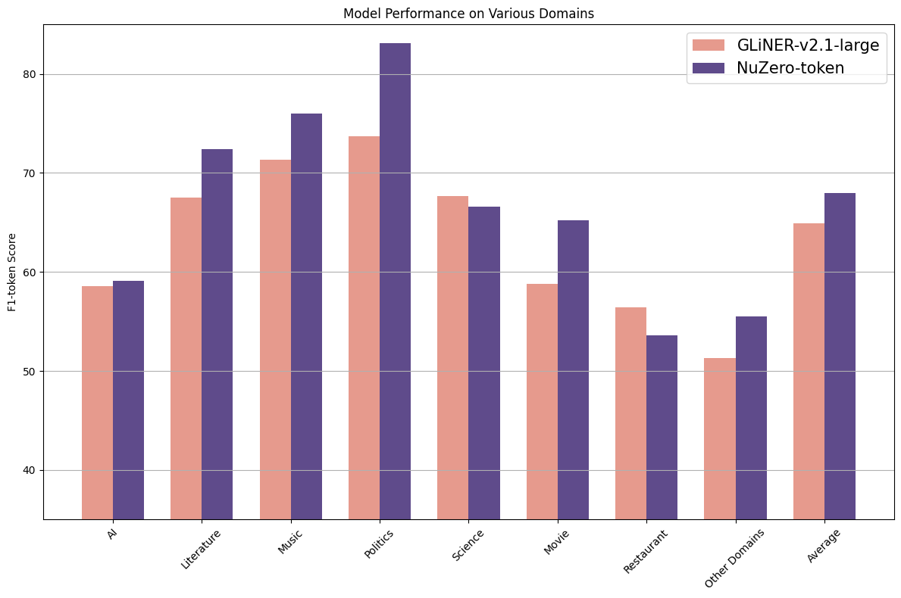

NuNER Zero is a zero-shot Named Entity Recognition (NER) Model. (Check [NuNER](https://huggingface.co/collections/numind/nuner-token-classification-and-ner-backbones-65e1f6e14639e2a465af823b) for the few-shot setting).

NuNER Zero uses the [GLiNER](https://huggingface.co/papers/2311.08526) architecture: its input should be a concatenation of entity types and text.

Unlike GliNER, NuNER Zero is a token classifier, which allows detect arbitrary long entities.

NuNER Zero was trained on [NuNER v2.0](https://huggingface.co/numind/NuNER-v2.0) dataset, which combines subsets of Pile and C4 annotated via LLMs using [NuNER's procedure](https://huggingface.co/papers/2402.15343).

NuNER Zero is (at the time of its release) the best compact zero-shot NER model (+3.1% token-level F1-Score over GLiNER-large-v2.1 on GLiNERS's benchmark)

<p align="left">

</p>

## Installation & Usage

```
!pip install gliner==0.1.12
```

**NuZero requires labels to be lower-cased**

```python
from gliner import GLiNER

def merge_entities(entities):
    if not entities:
        return []
    merged = []
    current = entities[0]
    for next_entity in entities[1:]:
        if next_entity['label'] == current['label'] and (next_entity['start'] == current['end'] + 1 or next_entity['start'] == current['end']):
            current['text'] = text[current['start']: next_entity['end']].strip()
            current['end'] = next_entity['end']
        else:
            merged.append(current)
            current = next_entity
    # Append the last entity
    merged.append(current)
    return merged


model = GLiNER.from_pretrained("numind/NuNerZero")

# NuZero requires labels to be lower-cased!
labels = ["organization", "initiative", "project"]
labels = [l.lower() for l in labels]

text = "At the annual technology summit, the keynote address was delivered by a senior member of the Association for Computing Machinery Special Interest Group on Algorithms and Computation Theory, which recently launched an expansive initiative titled 'Quantum Computing and Algorithmic Innovations: Shaping the Future of Technology'. This initiative explores the implications of quantum mechanics on next-generation computing and algorithm design and is part of a broader effort that includes the 'Global Computational Science Advancement Project'. The latter focuses on enhancing computational methodologies across scientific disciplines, aiming to set new benchmarks in computational efficiency and accuracy."

entities = model.predict_entities(text, labels)

entities = merge_entities(entities)

for entity in entities:
    print(entity["text"], "=>", entity["label"])
```

```
Association for Computing Machinery Special Interest Group on Algorithms and Computation Theory => organization
Quantum Computing and Algorithmic Innovations: Shaping the Future of Technology => initiative
Global Computational Science Advancement Project => project
```

## Fine-tuning

A fine-tuning script can be found [here](https://colab.research.google.com/drive/1-hk5AIdX-TZdyes1yx-0qzS34YYEf3d2?usp=sharing).


## Citation
### This work
```bibtex
@misc{bogdanov2024nuner,
      title={NuNER: Entity Recognition Encoder Pre-training via LLM-Annotated Data}, 
      author={Sergei Bogdanov and Alexandre Constantin and Timothée Bernard and Benoit Crabbé and Etienne Bernard},
      year={2024},
      eprint={2402.15343},
      archivePrefix={arXiv},
      primaryClass={cs.CL}
}
```
### Previous work
```bibtex
@misc{zaratiana2023gliner,
      title={GLiNER: Generalist Model for Named Entity Recognition using Bidirectional Transformer}, 
      author={Urchade Zaratiana and Nadi Tomeh and Pierre Holat and Thierry Charnois},
      year={2023},
      eprint={2311.08526},
      archivePrefix={arXiv},
      primaryClass={cs.CL}
}
```